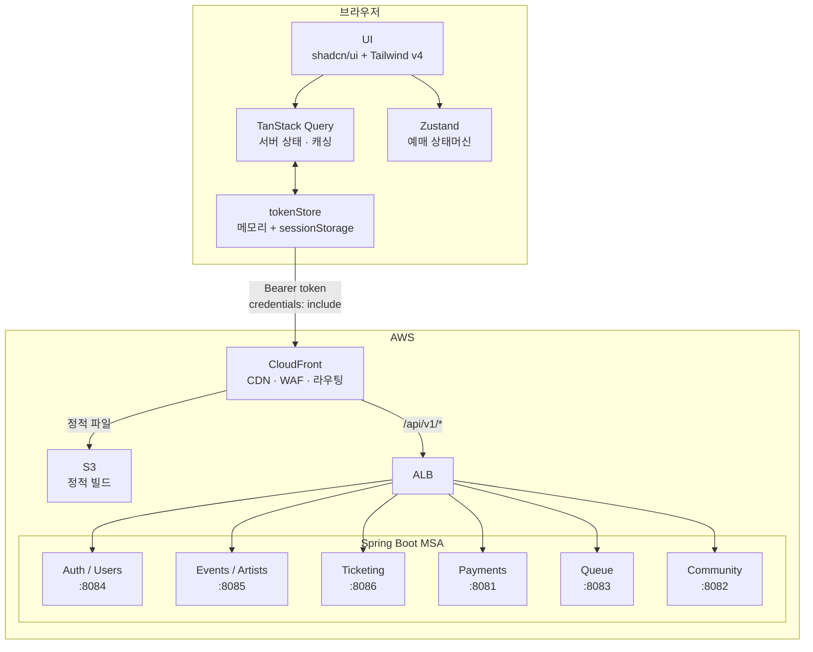
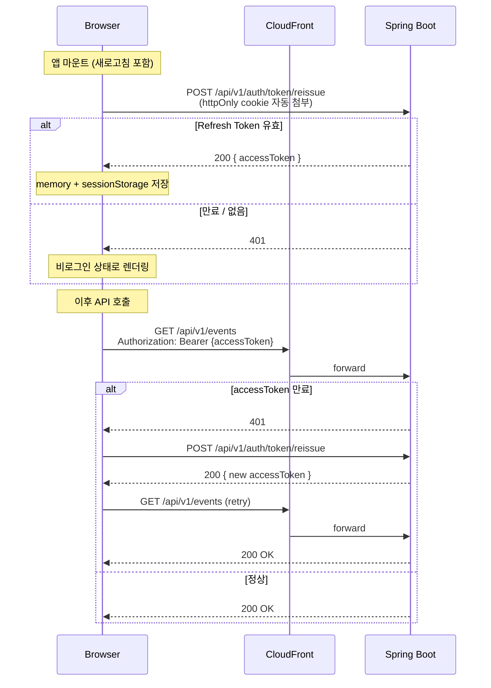

# URR (우르르)

> K-POP 찐팬을 위한 공정 티켓팅 플랫폼

**매크로·봇이 점령한 대기열** 문제를 해결하기 위해, 팬 활동 점수 기반 멤버십 등급으로 티켓 우선권을 차등 부여하는 공정 티켓팅 서비스입니다.  
티켓 예매 → 양도 → 팬 커뮤니티를 단일 플랫폼으로 통합합니다.

**15명 팀 · 프론트엔드 1인 단독 개발 · 약 10주**

| | |
|---|---|
| 연동 API | 45개 엔드포인트 |
| 개발 페이지 | 10개 라우트 |
| 머지 PR | 49회 |
| 트러블슈팅 문서화 | 6건 |

---

## 목차

1. [프로젝트 개요](#프로젝트-개요)
2. [팀 구성](#팀-구성)
3. [기술 스택](#기술-스택)
4. [아키텍처](#아키텍처)
5. [인증 전략 — JWT + httpOnly 쿠키](#인증-전략--jwt--httponly-쿠키)
6. [프로토타입 → Next.js 마이그레이션](#프로토타입--nextjs-마이그레이션)
7. [핵심 기능](#핵심-기능)
8. [화면 구성](#화면-구성)
9. [개발 방식 — AI 에이전트 협업](#개발-방식--ai-에이전트-협업)
10. [로컬 실행](#로컬-실행)
11. [트러블슈팅](#트러블슈팅)
12. [회고](#회고)
13. [관련 문서](#관련-문서)

---

## 프로젝트 개요

### 해결하는 문제

| 기존 문제                 | URR의 접근                                          |
| ------------------------- | --------------------------------------------------- |
| 매크로·봇이 대기열 점령   | 멤버십 등급 기반 대기열 우선순위로 자동화 접근 차단 |
| 찐팬도 티켓 구하기 어려움 | 멤버십 등급 기반 선예매 시스템                      |
| 암표·외부 양도 난무       | 플랫폼 내부 공식 양도 마켓 제공                     |
| 티켓팅·양도·커뮤니티 분산 | 단일 플랫폼 통합                                    |

### 멤버십 등급 체계

팬 활동 점수를 기반으로 등급이 상승하며 등급이 높을수록 예매 혜택이 증가합니다.

| 등급             | 조건         |   선예매 순서   | 양도 수수료 |
| ---------------- | ------------ | :-------------: | :---------: |
| Lv.4 라이트닝 🌩️ | 팬 점수 달성 |    **1순위**    |     5%      |
| Lv.3 썬더 ⚡     | 팬 점수 달성 | **2순위** (+1h) |     5%      |
| Lv.2 클라우드 ☁️ | 멤버십 가입  |    **3순위**    |     10%     |
| Lv.1 미스트 🌫️   | 회원가입     |    일반 예매    |  양도 불가  |

---

## 팀 구성

총 15명이 협업하여 개발한 프로젝트입니다.

| 역할                | 인원 |
| ------------------- | :--: |
| 프로덕트 매니지먼트 | 1명  |
| 프로덕트 디자인     | 3명  |
| 풀스택 (프론트엔드) | 1명  |
| 백엔드              | 2명  |
| 생성형 AI           | 2명  |
| 클라우드 네이티브   | 3명  |
| 사이버보안          | 3명  |

---

## 기술 스택

### Frontend

| 분야         | 기술                    | 선택 이유                             |
| ------------ | ----------------------- | ------------------------------------- |
| Framework    | Next.js 16 (App Router) | 서버 컴포넌트 기반 초기 렌더링 최적화 |
| Language     | TypeScript (strict)     | 도메인 타입 안전성 확보               |
| Styling      | Tailwind CSS v4         | 디자인 토큰 기반 스타일링             |
| UI           | shadcn/ui (Radix UI)    | 접근성 준수 + 커스터마이징 자유도     |
| Server State | TanStack Query v5       | API 캐싱 / 동기화 / 낙관적 업데이트   |
| Client State | Zustand                 | 최소한의 전역 상태 관리               |

### 핵심 기술 의사결정

#### Next.js 16 (App Router) — Vite + React SPA 대신 선택한 이유

디자인팀 프로토타입이 이미 Vite + React Router로 완성되어 있었습니다. 그럼에도 Next.js로 전환한 이유는 두 가지입니다.

1. **SSR 전환 경로 확보**: 현재는 S3 정적 배포이지만, EKS 전환 시 아티스트·공연 상세 페이지에 SSR을 적용해 SEO와 초기 렌더링을 개선할 계획입니다. SPA로 시작하면 이 전환 비용이 훨씬 큽니다.
2. **파일 기반 라우팅**: 중첩 레이아웃(`layout.tsx`), 동적 세그먼트(`[eventId]`), 경로별 `loading.tsx` 처리가 코드 없이 구조로 표현됩니다.

**트레이드오프**: S3 정적 배포 환경에서 CloudFront 페이지 전환이 full page reload를 유발해 JS 메모리가 초기화됩니다. OAuth 콜백 후 토큰 유실 문제가 발생했고, sessionStorage 백업으로 해결했습니다 (→ [트러블슈팅 #1](#1-s3-정적-배포-환경--oauth-콜백-토큰-유실-403-에러)).

---

#### TanStack Query v5 — `useState + useEffect` 패턴 대신 선택한 이유

초기 프로토타입은 모든 API 호출을 `useEffect` 안에서 처리했습니다. 이 패턴의 문제점은 다음과 같습니다.

- 캐시 없음 → 탭 전환 시마다 동일한 API 재호출
- 로딩/에러 상태를 컴포넌트마다 직접 관리 → 코드 중복
- 401 자동 재시도 로직을 수동으로 작성해야 함

TanStack Query를 도입하면서 staleTime/gcTime 설정으로 좌석 조회 API의 과호출을 막고, `onError` 콜백을 통해 인터셉터의 401 재시도와 자연스럽게 통합할 수 있었습니다.

**동작 방식**: Query Key 기반으로 전역 캐시를 관리합니다. 같은 Key를 여러 컴포넌트에서 구독하면 API는 1회만 호출되고 결과를 공유합니다. Background refetch로 화면 복귀 시 데이터를 자동 최신화합니다.

---

#### Zustand — Context API / Redux 대신 선택한 이유

예매 상태머신(`idle → queue → seats → payment → confirmation`)은 여러 라우트에 걸쳐 유지되어야 합니다. Context API는 상위 컴포넌트 리렌더링을 유발하고, Redux는 보일러플레이트가 과도합니다.

Zustand는 **선택적 구독(selector)** 으로 필요한 상태만 구독해 불필요한 리렌더링을 방지하고, 스토어를 `features/booking/model/` 안에 격리해 FSD 레이어 규칙을 지킬 수 있었습니다.

**auth에는 Zustand를 사용하지 않은 이유**: 인증 토큰은 전역 접근이 필요하지만 React 렌더링 사이클 밖에서도 읽어야 합니다(API 인터셉터). Zustand store는 React 트리 안에서만 접근 가능하므로, 인터셉터가 직접 읽을 수 있는 module-level 변수(`tokenStore.ts`)로 분리했습니다.

### Backend

| 분야      | 기술                               |
| --------- | ---------------------------------- |
| Framework | Spring Boot                        |
| 인증      | JWT / OAuth (카카오·네이버·이메일) |
| API       | REST API                           |

### Infra

| 분야       | 기술                                              |
| ---------- | ------------------------------------------------- |
| Hosting    | S3 정적 배포 (현재) → EKS 전환 예정 (SSR 적용 후) |
| CloudFront | CDN · Lambda@Edge · WAF · 통합 라우팅             |
| DB         | RDS                                               |
| Storage    | S3                                                |

> **현재**: SSR 미적용 상태로 Next.js를 정적 빌드(Static Export)하여 S3에 배포.
> **전환 계획**: 백엔드 API 연동 완료 후 이벤트 상세·아티스트 페이지 등에 SSR을 적용하며 EKS 컨테이너 배포로 전환.

---

## 아키텍처

### 시스템 전체 구조



> **현재**: S3 정적 배포. **전환 계획**: EKS + SSR 적용 후 sessionStorage 백업 제거 가능.

### Feature-Sliced Design (FSD)

도메인 중심 구조로 기능 단위의 독립성을 높이고, AI 에이전트 병렬 개발 시 레이어 경계가 코드 충돌 방지에 직접 기여했습니다.

```
src/
├── app/        # Next.js 라우팅 진입점
├── widgets/    # 페이지 단위 UI 블록
├── features/   # 사용자 행동 단위 기능
├── entities/   # 도메인 모델
└── shared/
    ├── api/    # fetch 클라이언트, 공통 에러 핸들링
    ├── lib/    # format.ts, constants.ts, utils.ts
    └── ui/     # shadcn 컴포넌트 (button, input, dialog …)
```

**레이어 규칙**: `app → widgets → features → entities → shared` 방향만 import 허용. feature 간 직접 import 금지.

```
features/<domain>/
├── ui/       # React 컴포넌트
├── model/    # Custom hooks · 상태 로직
├── api/      # API 요청 함수 (45개 엔드포인트)
└── index.ts  # public API
```

---

## 인증 전략 — JWT + httpOnly 쿠키

### 설계 원칙

티켓팅 플랫폼 특성상 결제·개인정보가 포함된 API를 다루기 때문에,
XSS 공격으로부터 토큰을 보호하는 것을 최우선 기준으로 삼았습니다.

| 방식                                        | XSS 내성 |   새로고침 복원   | 선택 여부 |
| ------------------------------------------- | :------: | :---------------: | :-------: |
| localStorage                                | ❌ 취약  |      ✅ 즉시      |  미채택   |
| **메모리 + sessionStorage + httpOnly 쿠키** | ⚠️ 일부  | ✅ reissue로 복원 | **채택**  |

> **아키텍처 제약(S3 정적 배포)에서 오는 불가피한 보안 트레이드오프**
>
> 원래 설계는 Access Token을 JavaScript 메모리에만 보관해 XSS 탈취를 차단하는 것이었습니다.
> 그러나 S3+CloudFront 정적 배포 환경에서 OAuth 콜백(`/auth/callback/kakao`) → 온보딩 페이지 전환 시
> CloudFront가 새 HTML 파일을 로드해 JS 메모리가 초기화되는 문제가 발생합니다.
>
> 이를 해결하기 위해 sessionStorage를 백업 저장소로 추가했습니다. XSS 공격자가 `sessionStorage.getItem('at')`으로
> Access Token을 탈취할 수 있으나, **Refresh Token은 httpOnly 쿠키로 보호**되고 Access Token 수명이 짧아(60분)
> 허용 가능한 트레이드오프로 판단했습니다. EKS(SSR) 전환 시 이 제약이 해소되어 메모리 단독 방식으로 복귀할 수 있습니다.

### 토큰 구조

```
Access Token  — JavaScript 메모리 (tokenStore) 우선 보관
                + sessionStorage 백업 (S3 정적 배포 제약으로 인한 트레이드오프)
                → 만료: 60분 (이후 자동 재발급)

Refresh Token — httpOnly 쿠키 (백엔드가 Set-Cookie로 내려줌)
                → JS에서 접근 불가 (브라우저만 관리)
                → 만료: 7일 (이후 재로그인 필요)
                → 브라우저가 자동으로 API 요청에 첨부
```

### 토큰 생명주기 · 세션 복원 흐름



### API 요청 인터셉터

모든 API 요청은 `src/shared/api/client.ts`를 통해 처리됩니다.

```
API 요청
  └─ Authorization: Bearer <Access Token> 헤더 자동 주입
       ├─ 200 → 정상 응답 반환
       └─ 401 → POST /api/auth/token/reissue
                 ├─ 성공 → 새 Access Token 저장 → 원본 요청 재시도
                 └─ 실패 → onAuthFailed() → /onboarding 리다이렉트
```

### 소셜 OAuth 플로우

```
/onboarding
  └─ [카카오/네이버 버튼 클릭]
       └─ 소셜 인가 페이지로 리다이렉트
            └─ /auth/callback/kakao (또는 /naver)
                 └─ POST /api/auth/oauth/kakao { code }
                      ├─ onboardingRequired: false → Access Token 저장 → /
                      └─ onboardingRequired: true  → /onboarding?step=identity
                                                       └─ 본인인증 완료 후
                                                            POST /api/auth/onboarding/social
```

### 관련 파일

| 파일                                       | 역할                                                        |
| ------------------------------------------ | ----------------------------------------------------------- |
| `src/shared/api/tokenStore.ts`             | 메모리 토큰 저장소 (get/set/clear)                          |
| `src/shared/api/client.ts`                 | fetch 래퍼 + 401 자동 재시도 인터셉터                       |
| `src/features/auth/ui/AuthInitializer.tsx` | 앱 마운트 시 세션 복원                                      |
| `src/features/auth/api/reissue.ts`         | `POST /api/auth/token/reissue` 호출                         |
| `src/widgets/layout/LayoutShell.tsx`       | `/onboarding`, `/auth/callback` 경로는 AuthInitializer 제외 |

---

## 프로토타입 → Next.js 마이그레이션

### 문제 정의

디자인팀이 제작한 Vite + React 프로토타입은 UI가 완성되어 있었지만 두 가지 한계가 있었습니다.

1. **확장 불가 구조**: 컴포넌트가 단일 flat 폴더에 혼재. 페이지가 늘어날수록 어디서 무엇을 import해야 하는지 추적이 어려워집니다.
2. **API 연동 불가**: `useState + useEffect`로 작성된 mock 데이터 코드가 실제 API 호출 코드와 구분되지 않아 교체 범위를 특정하기 어려웠습니다.

### 개선 과정

| 항목         | Prototype       | 전환 후                    |
| ------------ | --------------- | -------------------------- |
| Framework    | React (Vite)    | Next.js 16 (App Router)    |
| Router       | React Router v6 | 파일 기반 App Router        |
| State        | useState 중심   | TanStack Query + Zustand   |
| Architecture | Flat 구조       | FSD (레이어 import 규칙)   |

**핵심 원칙**: 디자인 1:1 유지. Tailwind 클래스, 레이아웃, 색상, 폰트 크기를 임의로 변경하지 않고 Next.js 문법(`Link`, `useRouter`, `public/` 경로)으로만 교체했습니다.

### 결과

- **API 교체 범위 명확화**: `features/<domain>/api/` 파일만 수정하면 mock → 실 API 전환이 완료됩니다. 실제로 Phase별 API 연동이 UI 변경 없이 진행됐습니다.
- **AI 에이전트 병렬 작업 가능**: FSD 레이어 규칙(상위→하위 단방향 import)이 에이전트 간 코드 충돌 방지에 직접 기여했습니다. `features/` 간 의존성이 없어 각 에이전트가 독립 브랜치에서 충돌 없이 작업할 수 있었습니다.

### 개선점 (잔존 기술 부채)

예매 Zustand store가 늦게 도입되어 일부 컴포넌트에 props drilling 코드가 잔존합니다. 초기 설계 시 상태머신 구조를 먼저 정의했더라면 리팩터링 비용을 줄일 수 있었습니다.

---

## 핵심 기능

### 예매 플로우

```
실시간 대기열 → 구역 선택 → 좌석 선택 → 결제 → 예매 확인
```

- **실시간 대기열**: WebSocket 기반 순번 대기 (10초 갱신). 등급별 입장 시각 차등 적용.
- **좌석 선택**: SVG 기반 인터랙티브 좌석도. 등급·가격·잔여 상태 색상 표시.
- **결제**: Toss Payments 모킹.

### 양도 마켓

- `listed` 상태만 수정·취소 가능 (마이페이지 양도 탭)
- 수정: 가격 변경 → 수수료 5% 자동 계산 표시
- 취소: 확인 다이얼로그 → 상태 `cancelled` 전환

### 멤버십 가입 플로우 (4단계)

```
아티스트 선택 → 티어 소개 → 결제 → 완료
```

---

## 화면 구성

| URL                   | 페이지          | 설명                                                     |
| --------------------- | --------------- | -------------------------------------------------------- |
| `/`                   | 홈              | 히어로 · 인기 아티스트 · 공연                            |
| `/artists`            | 아티스트 목록   | 그리드 + 검색                                            |
| `/artists/:id`        | 아티스트 상세   | 홈 / 소통 / 공연 / 양도 탭 (멤버십 게이트)               |
| `/events`             | 공연 목록       | 필터·정렬                                                |
| `/events/:id`         | 공연 상세       | 공연 정보 + 예매 진입                                    |
| `/events/:id/booking` | 예매 플로우     | 실시간 대기열 → 구역 선택 → 좌석 선택 → 결제 → 예매 확인 |
| `/membership`         | 멤버십 가입     | 4단계 플로우                                             |
| `/my-page`            | 마이페이지      | 티켓 / 멤버십 / 양도 / 설정 탭                           |
| `/onboarding`         | 로그인·회원가입 | 소셜 OAuth + 이메일                                      |
| `/search`             | 검색            | 아티스트·공연 통합 검색                                  |

### 주요 화면

| 홈 | 예매 플로우 |
|:--:|:--:|
|  |  |

| 아티스트 상세 | 마이페이지 |
|:--:|:--:|
|  |  |

> `docs/screenshots/` 폴더에 이미지를 추가하면 위 표에 자동으로 표시됩니다.

---

## 개발 방식 — AI 에이전트 협업

프론트엔드 개발은 **1인 개발**로 진행되었으며, AI 에이전트를 활용해 병렬 개발 워크플로우를 구성했습니다.

### 브랜치 전략

에이전트마다 독립 브랜치를 할당해 병렬 작업 후 PR로 통합합니다.

```
dev
 ├── feat/<scope>              ← 에이전트 A
 ├── feat/<scope>              ← 에이전트 B
 └── review/merge-<a>-<b>     ← 리뷰 에이전트 (충돌 조율)
          ↓ PR (Squash merge)
         dev
          ↓ PR (Merge commit)
         main
```

- **에이전트 1개 = 브랜치 1개**: 태스크 간 코드 의존 방지
- **리뷰 에이전트**: 두 feature 브랜치의 diff를 분석해 충돌 없는 병합 코드 자동 작성
- 자세한 규칙: [`CONTRIBUTING.md`](CONTRIBUTING.md)

---

## 로컬 실행

```bash
# 의존성 설치
npm install

# 개발 서버 (http://localhost:3000)
npm run dev

# 빌드 검증
npm run build
```

### 환경 변수

#### `.env` — 공통 설정 (저장소에 포함)

프로덕션 기본값. 직접 수정하지 않는다.

| 변수                             | 설명                                                   |
| -------------------------------- | ------------------------------------------------------ |
| `NEXT_PUBLIC_API_BASE_URL`       | 백엔드 API 기본 URL (서비스별 변수 미설정 시 fallback) |
| `NEXT_PUBLIC_KAKAO_CLIENT_ID`    | 카카오 OAuth 앱 키                                     |
| `NEXT_PUBLIC_KAKAO_REDIRECT_URI` | 카카오 OAuth 리디렉션 URI                              |
| `NEXT_PUBLIC_NAVER_CLIENT_ID`    | 네이버 OAuth 클라이언트 ID                             |
| `NEXT_PUBLIC_NAVER_REDIRECT_URI` | 네이버 OAuth 리디렉션 URI                              |

#### `.env.local` — 로컬 개발용 (git 제외)

도커 컴포즈로 백엔드 서비스를 로컬에서 띄울 때 사용한다.
저장소에 포함되지 않으므로 **개발자 각자가 직접 생성**해야 한다.

```bash
#NEXT_PUBLIC_API_BASE_URL=https://urr.guru/api/v1

NEXT_PUBLIC_PAYMENTS_API_URL=http://localhost:8081/api/v1
NEXT_PUBLIC_COMMUNITY_API_URL=http://localhost:8082/api/v1
NEXT_PUBLIC_QUEUE_API_URL=http://localhost:8083/api/v1
NEXT_PUBLIC_USERS_API_URL=http://localhost:8084/api/v1
NEXT_PUBLIC_EVENTS_API_URL=http://localhost:8085/api/v1
NEXT_PUBLIC_TICKETING_API_URL=http://localhost:8086/api/v1
```

설정하지 않은 서비스는 자동으로 `NEXT_PUBLIC_API_BASE_URL`(프로덕션)로 fallback된다.

#### 서비스별 포트 (도커 컴포즈 기준)

| 서비스           | 포트 | 환경 변수                       |
| ---------------- | ---- | ------------------------------- |
| payments         | 8081 | `NEXT_PUBLIC_PAYMENTS_API_URL`  |
| community        | 8082 | `NEXT_PUBLIC_COMMUNITY_API_URL` |
| queue            | 8083 | `NEXT_PUBLIC_QUEUE_API_URL`     |
| auth / users     | 8084 | `NEXT_PUBLIC_USERS_API_URL`     |
| events / artists | 8085 | `NEXT_PUBLIC_EVENTS_API_URL`    |
| ticketing        | 8086 | `NEXT_PUBLIC_TICKETING_API_URL` |

---

## 트러블슈팅

### 1. S3 정적 배포 환경 — OAuth 콜백 토큰 유실 (403 에러)

**현상**

카카오 소셜 로그인 완료 후 본인인증 단계에서 API 요청이 403을 반환했습니다. 로컬 개발 서버에서는 정상 동작했지만 S3+CloudFront 배포 환경에서만 발생했습니다.

**원인 분석**

OAuth 콜백(`/auth/callback/kakao`) 처리 후 `/onboarding?step=identity`로 이동할 때 CloudFront가 새 HTML 파일을 로드합니다. 이 과정에서 **전체 페이지 리로드가 발생해 JavaScript 메모리가 초기화**되면서 직전에 저장한 Access Token이 사라졌습니다.

```
OAuth 콜백 처리
  └─ POST /api/auth/oauth/kakao → accessToken 메모리에 저장
       └─ router.push("/onboarding?step=identity")
            └─ CloudFront: 새 HTML 로드 (full page reload)
                 └─ JS 메모리 초기화 → accessToken = null
                      └─ 본인인증 API 요청 → 403
```

**해결**

`tokenStore`에 sessionStorage 백업 계층을 추가했습니다. Access Token 저장 시 sessionStorage에도 복사하고, 모듈 로드 시 자동 복원합니다.

```ts
// src/shared/api/tokenStore.ts
setToken: (token: string): void => {
  accessToken = token;
  sessionStorage.setItem("at", token);          // 페이지 리로드 대비
  setClientCookie("is_authenticated", "1", 86400);
},
```

```ts
// 모듈 초기화 시 복원
let accessToken: string | null =
  typeof window !== "undefined" ? sessionStorage.getItem("at") : null;
```

> **보안 트레이드오프**: XSS 공격자가 `sessionStorage.getItem('at')`으로 Access Token을 탈취할 수 있습니다. 그러나 Refresh Token은 httpOnly 쿠키로 보호되고 Access Token 수명이 짧아(60분) 허용 가능한 트레이드오프로 판단했습니다. EKS(SSR) 전환 시 sessionStorage 없이 메모리 단독 방식으로 복귀할 수 있습니다.

> 📝 **심화 글**: <!-- [S3 정적 배포 환경에서 OAuth 토큰을 안전하게 관리하는 법](https://blog.example.com) -->

---

### 2. 백엔드 API 경로에 `/api/v1` 접두사 추가 — 모든 API 요청이 백엔드에 미도달

**현상**

특정 시점 이후 프로덕션에서 로그인·공연 조회·예매 등 모든 API가 실패했습니다. 로컬에서는 정상 동작.

**원인 분석**

백엔드 팀이 배포 중반에 모든 엔드포인트 경로에 `/api/v1` 버전 접두사를 추가했습니다. 기존 프론트엔드는 `https://urr.guru` 기준으로 `/auth/login` 등 접두사 없는 경로를 사용하고 있었고, CloudFront는 `/api/v1/*` 경로만 백엔드 ALB로 라우팅하도록 설정되어 있어, 변경 전 경로 요청은 전부 S3(정적 파일)로 라우팅돼 404가 발생했습니다.

```
# 백엔드 변경 전 (기존 동작)
GET https://urr.guru/auth/login  → ALB → Spring Boot ✅

# 백엔드가 /api/v1 접두사 추가 후
GET https://urr.guru/auth/login  → S3 → 404 ❌

# 프론트엔드 대응 후
GET https://urr.guru/api/v1/auth/login  → ALB → Spring Boot ✅
```

**해결**

`NEXT_PUBLIC_API_BASE_URL`에 `/api/v1`을 포함하도록 CD 파이프라인 환경 변수를 수정하고, 각 API 파일의 경로에서 중복된 `/api/v1` 접두사를 모두 제거했습니다.

> **교훈**: 백엔드 API 버전 정책(경로 접두사 유무)이 바뀔 경우 CloudFront 라우팅 규칙과 프론트엔드 Base URL을 함께 변경해야 합니다. 변경 전 프론트엔드 팀에 사전 공유가 필요합니다.

> 📝 **심화 글**: <!-- [CloudFront + S3 정적 배포에서 API 라우팅 설계하기](https://blog.example.com) -->

---

### 3. 로그인 상태에서 `/onboarding` 직접 접근 가능

**현상**

소셜 로그인으로 인증을 완료한 상태에서 `/onboarding`을 직접 입력하면 로그인 화면이 그대로 노출됐습니다.

**원인 분석**

| 계층               | 확인 방법                                   | 문제                                             |
| ------------------ | ------------------------------------------- | ------------------------------------------------ |
| Next.js middleware | 서버에서 httpOnly 쿠키 확인                 | `refresh_token` 쿠키 없으면 비인증으로 판단      |
| OnboardingWidget   | 클라이언트에서 `tokenStore.getToken()` 확인 | 새로고침 시 메모리 초기화 → 항상 비인증으로 보임 |

`middleware.ts`에서 `is_authenticated` 쿠키로 이중 체크를 시도했으나 Edge Runtime 환경에서 빌드 오류가 발생해 middleware 자체를 제거하고 클라이언트 레벨 방어로 전환했습니다.

**해결**

`OnboardingWidget` 마운트 시 두 단계로 인증 상태를 확인합니다.

```ts
useEffect(() => {
  // 1단계: 메모리에 토큰이 있으면 즉시 리다이렉트
  if (tokenStore.getToken()) {
    router.replace("/");
    return;
  }
  // 2단계: 메모리가 비어 있으면 reissue로 세션 유효 여부 확인
  reissueToken().then((token) => {
    if (token) {
      tokenStore.setToken(token);
      router.replace("/");
    } else {
      setAuthChecked(true); // 비로그인 확정 → 로그인 화면 렌더링
    }
  });
}, []);
```

| 시나리오                               | 수정 전          | 수정 후                        |
| -------------------------------------- | ---------------- | ------------------------------ |
| 로그인 후 `/onboarding` 주소 직접 입력 | 로그인 화면 노출 | 홈(`/`)으로 리다이렉트         |
| 새로고침 후 `/onboarding` 접근         | 로그인 화면 노출 | 세션 복원 후 홈으로 리다이렉트 |
| 로그아웃 후 `/onboarding` 접근         | 정상             | 정상                           |

---

### 4. React Compiler와 수동 `useCallback` 충돌

**현상**

온보딩 플로우(소셜 로그인 → 본인인증 → 가입 완료)에서 특정 단계로 넘어갈 때 화면이 멈추거나 핸들러가 실행되지 않는 현상이 간헐적으로 발생했습니다.

**원인 분석**

Next.js 16에는 React Compiler(실험적)가 포함되어 있습니다. React Compiler는 컴포넌트를 자동으로 메모이제이션하므로, 개발자가 수동으로 작성한 `useCallback`이 Compiler의 최적화와 **이중으로 적용**되어 함수 참조가 의도치 않게 고정됐습니다.

```ts
// 문제: useCallback + React Compiler 이중 메모이제이션
const handleNext = useCallback(() => {
  setStep((prev) => prev + 1);
}, []); // deps 배열이 Compiler 최적화와 충돌
```

**해결**

`useOnboardingAuth` 훅에서 수동 `useCallback`을 모두 제거했습니다. React Compiler가 알아서 최적화하므로 수동 메모이제이션이 불필요합니다.

> **교훈**: React Compiler를 사용하는 환경에서는 `useMemo` / `useCallback`을 수동으로 작성하지 않습니다. Compiler가 관리하는 메모이제이션과 수동 메모이제이션이 공존하면 예측하기 어려운 버그가 생깁니다.

> 📝 **심화 글**: <!-- [Next.js 16 React Compiler와 수동 메모이제이션의 충돌](https://blog.example.com) -->

---

### 5. 로그인 전환 시 이전 사용자 정보 잔존

**현상**

소셜 로그인 후 로그아웃 → 일반 로그인 전환 시, 새로고침하기 전까지 이전 소셜 계정의 이름·정보가 그대로 표시됐습니다.

**원인 분석**

로그아웃 시 `tokenStore.clearToken()`으로 Access Token과 sessionStorage는 정상 삭제됐지만, **TanStack Query 캐시가 초기화되지 않았습니다.** 새 토큰으로 요청을 보내기 전에 캐시된 `/auth/me` 응답이 이전 사용자 데이터를 반환했고, 쿼리 staleTime(5분)이 남아 있어 재요청도 발생하지 않았습니다.

```
로그아웃
  └─ clearToken() → accessToken = null, sessionStorage 삭제 ✅
  └─ queryClient.clear() 누락 ❌

새 계정으로 로그인
  └─ setToken(newToken) ✅
  └─ useCurrentUser() → 캐시 히트 → 이전 사용자 데이터 반환 ❌
```

**해결**

토큰이 교체되는 세 지점 모두에 `queryClient.clear()`를 추가했습니다.

| 위치 | 시점 |
| ---- | ---- |
| `SettingsTab.tsx` | 로그아웃 확인 후 |
| `AccountDeleteDialog.tsx` | 탈퇴 완료 후 |
| `SocialCallbackWidget.tsx` | 새 소셜 토큰 세팅 직전 (`clearToken()` + `queryClient.clear()`) |

```ts
// 소셜 콜백에서 이전 세션 완전 초기화 후 교체
tokenStore.clearToken();
queryClient.clear();
tokenStore.setToken(result.tokens.accessToken);
```

> **교훈**: 토큰 교체 시 `clearToken()`만으로는 부족합니다. TanStack Query 캐시는 토큰과 독립적으로 살아있으므로, 사용자가 바뀌는 모든 지점에서 반드시 `queryClient.clear()`를 함께 호출해야 합니다.

---

### 6. 소셜 로그인 온보딩 미완료 이탈 → `/auth/me` CORS 오류 + 무한 리다이렉트 루프

**현상**

소셜 로그인 후 본인인증 단계에서 브라우저 뒤로가기로 이탈하면, 이후 어느 페이지로 이동해도 `/auth/me` CORS 오류가 발생하며 앱을 사용할 수 없었습니다.

**원인 분석**

브라우저 히스토리와 클라이언트 상태가 맞물려 루프가 형성됐습니다.

```
[히스토리 스택]
/landing → /onboarding → /auth/callback/kakao → /onboarding?step=identity
                                                 ↑ 현재 위치

뒤로가기 1회 → /onboarding
  OnboardingWidget: 토큰 감지 → router.replace("/")

뒤로가기 2회 → /landing (replace 직전 엔트리)
  홈 페이지: useCurrentUser() → fetchMe() → CORS 오류
  → !user 판정 → router.replace("/landing")
  → 다음 이동 시도 → 토큰 여전히 존재 → 홈 → CORS → 랜딩 → 무한 반복
```

두 가지 문제가 결합됐습니다.

1. **온보딩 가드 부재**: `onboardingCompleted: false` 사용자가 보호 경로에 그대로 진입
2. **오류 시 토큰 미초기화**: `fetchMe()` 실패 후에도 토큰이 남아 있어 이후 진입마다 동일 오류 반복

**해결**

두 문제를 각각 수정했습니다.

**(1) `OnboardingGuard` 추가** — 모든 보호 경로에 온보딩 상태 가드 적용

```ts
// src/widgets/layout/LayoutShell.tsx
function OnboardingGuard({ children }) {
  const { data: user, isLoading, isError } = useCurrentUser();

  useEffect(() => {
    if (isLoading) return;
    if (user && !user.onboardingCompleted) {
      router.replace("/onboarding?step=identity");  // 온보딩 재진입
    }
    if (isError) {
      tokenStore.clearToken();   // 잔존 토큰 제거
      queryClient.clear();
      router.replace("/landing"); // 루프 차단
    }
  }, [user, isLoading, isError]);
}
```

**(2) `OnboardingWidget` 토큰 체크 개선** — 기존 토큰 존재 시 `fetchMe()`로 상태 검증 후 분기

```ts
if (tokenStore.getToken()) {
  fetchMe()
    .then((user) => {
      router.replace(user.onboardingCompleted ? "/" : "/onboarding?step=identity");
    })
    .catch(() => {
      tokenStore.clearToken(); // fetchMe 실패 시 토큰 초기화 → 재로그인 유도
      setAuthChecked(true);
    });
  return;
}
```

| 시나리오 | 수정 전 | 수정 후 |
| -------- | ------- | ------- |
| 온보딩 미완료 상태로 보호 경로 진입 | CORS 오류 + 무한 루프 | `/onboarding?step=identity`로 리다이렉트 |
| `fetchMe()` 실패 (CORS 포함) | 토큰 잔존 → 루프 | 토큰 초기화 → `/landing`에서 재로그인 가능 |
| 정상 로그인 사용자 | 영향 없음 | 영향 없음 |

> **교훈**: 소셜 OAuth 콜백은 항상 **onboardingRequired** 플래그를 확인하고, 미완료 사용자가 보호 경로에 진입하지 못하도록 클라이언트 레벨 가드가 반드시 필요합니다. 또한 인증 관련 오류(CORS 포함)는 토큰 초기화로 마무리해야 오류 상태가 다음 세션으로 전파되지 않습니다.

---

### 7. 예매하기 클릭 시 모달이 깜빡이고 예매 페이지로 이동되지 않는 문제

**현상**

`/events/:id` 상세 페이지에서 예매하기 버튼을 클릭하면 대기열 모달이 잠깐 깜빡이다 사라지고, 예매 페이지(`/events/:id/booking`)로 이동되지 않았습니다.

**원인 분석**

`useBookingStore`는 전역 Zustand 스토어로, 이벤트 상세 페이지(`EventBookingSidebar`)와 예매 페이지(`BookingWidget`) 양쪽의 `BookingProvider`가 동일한 인스턴스를 공유합니다.

대기열 통과 시 `handleQueuePassed`의 실행 순서가 문제였습니다.

```
[handleQueuePassed 실행 순서]

1. sessionStorage.setItem("urr:booking:startPhase", "seats-section")
2. resetBooking()  ← isLoading = true 로 변경
3. router.push("/events/1/booking")

[부작용]

resetBooking() → isLoading 변경
  → 이벤트 상세 페이지의 BookingContext.useEffect 발동
    조건: !showsLoading && eventDates.length > 0 && isLoading === true
    → sessionStorage 키 읽기 & 삭제  ← 예매 페이지 몫의 키를 소비
    → transitionTo("seats-section")  (이벤트 상세 페이지에서 불필요하게 실행)

[예매 페이지 진입]

BookingGuard: sessionStorage.getItem("urr:booking:startPhase") → null
  → router.replace("/events/1")  ← 다시 이벤트 상세 페이지로 되돌아감
```

즉, `resetBooking()`이 `isLoading`을 `true`로 바꾸는 순간, **이벤트 상세 페이지의** `BookingContext.useEffect`가 먼저 sessionStorage 키를 소비해버려 예매 페이지의 `BookingGuard`가 키를 찾지 못하고 리다이렉트하는 순환이 발생했습니다.

**해결**

역할을 분리했습니다. `handleQueuePassed`에서 `resetBooking()` 호출을 제거하고, 대신 `BookingGuard`가 진입 허가 시점에 직접 `reset()`을 호출하도록 변경했습니다.

**`EventBookingSidebar.handleQueuePassed`** — `resetBooking()` 제거

```ts
// before
const handleQueuePassed = (_token: string | null) => {
  sessionStorage.setItem("urr:booking:startPhase", "seats-section");
  resetBooking();  // ← 이벤트 상세 페이지 useEffect가 키 소비
  router.push(`/events/${event.id}/booking`);
};

// after
const handleQueuePassed = (_token: string | null) => {
  sessionStorage.setItem("urr:booking:startPhase", "seats-section");
  router.push(`/events/${event.id}/booking`);
  // reset은 BookingGuard에서 처리
};
```

**`BookingGuard`** — 진입 시 `reset()` 호출

```ts
// before
useEffect(() => {
  const hasKey = sessionStorage.getItem("urr:booking:startPhase") !== null;
  if (!hasKey) {
    router.replace(`/events/${eventId}`);
  } else {
    setAuthorized(true);
  }
}, [eventId, router]);

// after
useEffect(() => {
  const hasKey = sessionStorage.getItem("urr:booking:startPhase") !== null;
  if (!hasKey) {
    router.replace(`/events/${eventId}`);
  } else {
    reset();           // isLoading = true → 예매 페이지 BookingContext가 키를 소비
    setAuthorized(true);
  }
}, [eventId, router, reset]);
```

이렇게 하면 이벤트 상세 페이지가 언마운트된 이후에 `reset()`이 호출되므로 해당 페이지의 `BookingContext.useEffect`가 키를 가로채지 않습니다.

| 시나리오 | 수정 전 | 수정 후 |
| -------- | ------- | ------- |
| 예매하기 → 대기열 통과 | 모달 깜빡임 후 이벤트 상세 페이지로 복귀 | 예매 페이지(`seats-section`)로 정상 이동 |
| 예매 페이지 직접 URL 접근 | 영향 없음 | 영향 없음 (키 없으면 상세 페이지로 리다이렉트) |
| 모달 닫기(취소) | 정상 | 정상 |

> **교훈**: 전역 상태(Zustand)를 여러 페이지의 Provider가 공유할 때, 상태 변경의 부작용(side-effect)이 예상치 못한 페이지의 `useEffect`를 트리거할 수 있습니다. 페이지 이동을 위한 초기화는 **이동 대상 페이지(Guard)**에서 처리하고, 출발 페이지에서는 최소한의 작업만 수행해야 합니다.

---

## 회고

### 잘 된 것

| 항목 | 내용 |
| ---- | ---- |
| FSD + AI 에이전트 병렬 개발 | 레이어 단방향 import 규칙 덕분에 에이전트 간 코드 충돌이 없었습니다. `ui/` → `model/` → `api/` 레이어 순서로 세션을 나눠도 중단·재개가 자연스러웠습니다. |
| 인증 설계 | httpOnly 쿠키 + 메모리 토큰 조합으로 XSS 노출 면적을 최소화했습니다. 401 자동 재시도 인터셉터가 TanStack Query의 에러 흐름과 자연스럽게 통합됐습니다. |
| 환경 변수 기반 멀티 서비스 URL | 서비스별 Base URL을 분리해 일부 서비스만 로컬에서 개발하고 나머지는 프로덕션을 바라보는 혼합 개발이 가능했습니다. |

### 아쉬운 것

| 항목 | 원인 | 다음에는 |
| ---- | ---- | -------- |
| TierLevel 대소문자 불일치로 전면 수정 | 백엔드 API 스펙을 확인하지 않고 프론트 편의 기준으로 타입을 먼저 정의 | 공용 타입은 API 스펙 문서에서 그대로 가져오고, 변환이 필요하면 단일 파서 함수 1곳에서만 처리 |
| API Base URL 접두사 누락으로 프로덕션 전체 장애 | CD 환경 변수 값의 경로 포함 여부를 명시적으로 문서화하지 않음 | 환경 변수 스펙을 README에 명시하고, 최초 배포 직후 API 호출 1회를 체크리스트 항목으로 추가 |
| 예매 Zustand store 늦은 도입 | 상태머신 설계 없이 UI 먼저 구현 후 스토어를 나중에 추가 | 여러 라우트에 걸치는 상태는 초기 설계 시 스토어로 먼저 정의 |

### 다음 개선 목표

- **예매 대기열 WebSocket**: 현재 10초 polling → WebSocket 실시간 전환
- **SSR 적용 + EKS 전환**: 공연 상세·아티스트 페이지 SEO 개선, sessionStorage 백업 제거 가능
- **커뮤니티 소통 탭 실 API 연동**: 현재 mock 데이터 사용 중
- **Lighthouse 성능 측정**: 이미지 최적화, Core Web Vitals 기준 점수 확보

---

## 관련 문서

| 문서                                 | 내용                                          |
| ------------------------------------ | --------------------------------------------- |
| [`CONTRIBUTING.md`](CONTRIBUTING.md) | 브랜치 전략, 커밋 규칙, AI 에이전트 작업 규칙 |
| [`CLAUDE.md`](CLAUDE.md)             | AI 에이전트용 프로젝트 컨텍스트 가이드        |
